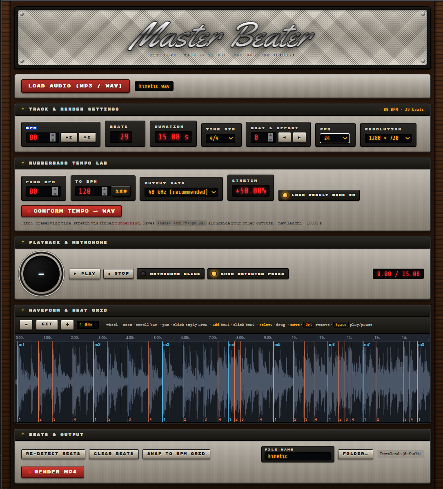

# Master Beater

<p align="center">
  
</p>

BPM detector, beat editor, tempo-conform tool, and beat-overlay video renderer.

Load an MP3 or WAV, auto-detect the beats and BPM, hand-edit the beat grid on a
zoomable waveform, watch a pilot lamp flash in time (with an optional metronome),
optionally time-stretch the track to a new tempo, and render an MP4 the full
length of the song with a `Beat: N   Measure: M   Frame: F` overlay burned onto
the frame each beat lands on — plus a matching `beats.json` and a `beats.srt`
that doubles as a DaVinci Resolve marker track.

Everything runs locally: detection, editing and playback happen in the browser;
a tiny Node server shells out to FFmpeg for the render and the tempo conform.

---

## Installation

You need two things installed once — **Node.js** and **FFmpeg** — then you drop
the app folder anywhere and run it. Follow the steps for your platform.

### Step 1 — Install Node.js (all platforms)

1. Go to <https://nodejs.org> and download the **LTS** installer (version **18 or
   newer**).
2. Run the installer and accept the defaults.
3. Open a terminal — **Terminal** on macOS/Linux, **PowerShell** or **Command
   Prompt** on Windows — and check it worked:

   ```bash
   node --version
   ```

   You should see `v18.x.x` or higher.

### Step 2 — Install FFmpeg

FFmpeg does the video render and the pitch-preserving tempo stretch. The app runs
plain `ffmpeg` from your `PATH`. For the **Rubberband Tempo Lab** you need a build
that includes the `rubberband` filter — the "full" builds below have it, the
"essentials" builds do **not**. Everything except the Tempo Lab works with any
FFmpeg; the app detects a missing `rubberband` filter and greys out that one
panel.

<details open>
<summary><b>macOS</b></summary>

**Recommended — Homebrew** (its FFmpeg is built with `rubberband`):

1. If you don't have Homebrew, install it — paste the command from
   <https://brew.sh> into Terminal and follow the prompts.
2. Install FFmpeg:

   ```bash
   brew install ffmpeg
   ```

3. Verify (the second command should print a line, not nothing):

   ```bash
   ffmpeg -version
   ffmpeg -hide_banner -filters | grep rubberband
   ```

Homebrew puts `ffmpeg` on your `PATH` automatically (`/opt/homebrew/bin` on Apple
Silicon, `/usr/local/bin` on Intel).

**Without Homebrew** (note: these builds may not include `rubberband` — use
Homebrew if you need the Tempo Lab):

1. Download the latest `ffmpeg` build from <https://evermeet.cx/ffmpeg/>.
2. Double-click the downloaded `.zip` to unpack it — you get a single file named
   `ffmpeg`.
3. Move it into `/usr/local/bin` so it's on your `PATH`:

   ```bash
   sudo mkdir -p /usr/local/bin
   sudo mv ~/Downloads/ffmpeg /usr/local/bin/ffmpeg
   sudo chmod +x /usr/local/bin/ffmpeg
   ```

4. The first time you run it, macOS blocks it ("cannot verify the developer").
   Open **System Settings → Privacy & Security**, scroll to the bottom, click
   **Allow Anyway**, then run `ffmpeg -version` once more and click **Open**.

</details>

<details open>
<summary><b>Windows</b></summary>

**Recommended — winget** (installs a full build and sets `PATH` for you):

```powershell
winget install "FFmpeg (Full build)"
```

Close and reopen PowerShell afterwards, then verify:

```powershell
ffmpeg -version
ffmpeg -hide_banner -filters | findstr rubberband
```

**Manual install:**

1. Go to <https://www.gyan.dev/ffmpeg/builds/>.
2. Under **release builds**, download **`ffmpeg-release-full.7z`**. (The `full`
   build has the `rubberband` filter; `essentials` does not.)
3. Extract the `.7z` with [7-Zip](https://www.7-zip.org/) or WinRAR. You get a
   folder like `ffmpeg-7.1-full_build`.
4. Move that folder to `C:\ffmpeg` so the program ends up at
   **`C:\ffmpeg\bin\ffmpeg.exe`**.
5. Add `C:\ffmpeg\bin` to your `PATH`:
   - Press **Start**, type `environment variables`, open **Edit the system
     environment variables**.
   - Click **Environment Variables…**
   - Under **User variables**, select **Path** → **Edit…** → **New**, paste
     `C:\ffmpeg\bin`, then **OK** on every dialog.
   - Close and reopen any terminal windows.
6. Verify in a **new** PowerShell window:

   ```powershell
   ffmpeg -version
   ffmpeg -hide_banner -filters | findstr rubberband
   ```

</details>

<details open>
<summary><b>Linux</b></summary>

Install from your package manager (all include `librubberband`):

```bash
# Debian / Ubuntu
sudo apt install ffmpeg

# Fedora (enable RPM Fusion first)
sudo dnf install ffmpeg

# Arch
sudo pacman -S ffmpeg
```

Verify:

```bash
ffmpeg -hide_banner -filters | grep rubberband
```

</details>

**Prefer not to touch `PATH`?** Set the `FFMPEG` environment variable instead —
point it at the binary *or* at the folder containing it:

- macOS / Linux: `export FFMPEG=/usr/local/bin/ffmpeg`
- Windows (PowerShell): `$env:FFMPEG = "C:\ffmpeg\bin"`

### Step 3 — Get Master Beater

**Option A — download the ZIP:**

1. On the GitHub page, click the green **Code** button → **Download ZIP**.
2. Unzip it somewhere permanent, e.g. `~/Apps/master-beater` (macOS/Linux) or
   `C:\Apps\master-beater` (Windows).

**Option B — clone with git:**

```bash
git clone https://github.com/DeeKozman/master-beater.git
```

### Step 4 — Install dependencies and run

Open a terminal **inside the `master-beater` folder** and run:

```bash
npm install
npm start
```

Then open **<http://localhost:8461>** in **Chrome or Edge**.

**One-click launchers** (they install dependencies on first run, start the
server, and open your browser):

- **macOS / Linux:** `./start.sh` — the first time, make it executable with
  `chmod +x start.sh stop.sh`. Stop the server with `./stop.sh`.
- **Windows:** double-click **`start.bat`**. Stop it with **`stop.bat`**.

### Browser support

Use **Chrome or Edge** for the **Folder…** button (save outputs straight into a
folder you pick — this uses the File System Access API). On **Safari** or
**Firefox** that button falls back to putting the three output files
(`.mp4`, `.beats.json`, `.beats.srt`) in your normal Downloads folder; Safari may
ask you to allow multiple downloads the first time. Everything else works in all
modern browsers.

### Changing the port

The server listens on **8461**. To use a different port, set `PORT`:

- macOS / Linux: `PORT=9000 npm start`
- Windows (PowerShell): `$env:PORT = 9000; npm start`

---

## Workflow

1. **Load audio** — pick an MP3/WAV. It decodes in the browser and detection runs
   automatically.
2. **Check the BPM and grid** in *Track & Render Settings* and on the waveform.
   Fix the tempo, set the time signature, nudge *Beat 1 offset* so the downbeats
   land where they should, or hit **Snap to BPM grid** to replace the detected
   beats with a perfectly regular grid.
3. *(optional)* **Conform the tempo** in the *Rubberband Tempo Lab* — e.g. pull a
   119 BPM track to a clean 120.
4. **Preview** — hit Play (or Space). The pilot lamp flashes each beat; turn on
   the metronome to hear the grid.
5. **Render** — set FPS, resolution and a file name, optionally choose an output
   folder, and hit **Render MP4**. You get the video plus `beats.json` and
   `beats.srt`.

Every panel below *Load audio* has a header you can click to **collapse** it.
Collapse state is remembered per panel (in `localStorage`). The collapsed
*Track & Render Settings* header still shows the current BPM and beat count.

---

## Panels

### Load audio

Accepts anything the browser can decode (MP3, WAV, and usually M4A/OGG/FLAC).
The log reports channel count, sample rate and duration after decoding. Note the
browser may resample to its own audio rate on decode (a 44.1 kHz file often comes
back as 48 kHz) — this only affects the in-browser analysis, not your source file
or the render, which always use the original upload.

### Track & Render Settings

| Control | What it does |
| --- | --- |
| **BPM** | Detected tempo, editable (30–300). **÷2 / ×2** halve or double it (handy when detection locks onto the off-beat or double-time). |
| **Beats** | Live count of beats currently on the grid. |
| **Duration** | Track length in seconds. |
| **Time sig** | 4/4, 3/4, 2/4, 6/8, 5/4, 7/8 — sets how many beats are in a measure, which drives the `Beat:` cycle and the downbeat highlighting. |
| **Beat 1 offset** | Index of the beat that counts as beat 1 of measure 1. Use the ◀ ▶ buttons to slide the barline until the blue downbeats sit on the actual downbeats. |
| **FPS** | Render frame rate: 12 / 24 / 30 / 60. Also sets each beat's `Frame:` number. |
| **Resolution** | Render size: 640×360 / 1280×720 / 1920×1080. |

### Rubberband Tempo Lab

Pitch-preserving time-stretch to conform a track from one tempo to another.

| Control | What it does |
| --- | --- |
| **From BPM** | Source tempo, auto-filled from detection, editable. |
| **To BPM** | Target tempo (default 120). The **120** button is a one-click set. |
| **Output rate** | **48 kHz (recommended)** or **Match source**. |
| **Stretch** | Live readout of the speed change (`+0.84%`) and the resulting length. |
| **Load result back in** | When checked, the conformed WAV replaces the loaded track and re-detection runs, so you can grid and render against the new tempo straight away. |
| **Conform Tempo → WAV** | Runs the stretch and saves `<name>_<toBPM>bpm.wav` next to your other outputs. |

The server runs:

```
ffmpeg -i in -af "aresample=48000:resampler=soxr:precision=28,rubberband=tempo=<to/from>:pitch=1" -c:a pcm_s16le out.wav
```

Pitch is preserved. Output defaults to **48 kHz** because the `rubberband` filter
drifts a few tens of milliseconds at 44.1 kHz — resampling to 48 kHz first makes
the stretch sample-exact, and keeps multiple stems phase-locked when they are all
conformed with the same ratio. **Match source** skips the resample if you need to
stay at the original rate.

The button is disabled when there is no audio loaded, when the ratio is outside
0.5×–2.0× (halve/double first), when From and To are equal, or when FFmpeg has no
`rubberband` filter (the header says so).

### Playback & Metronome

| Control | What it does |
| --- | --- |
| **Play / Pause** | Start/stop playback (also **Space**). |
| **Stop** | Stop and reset to the start. |
| **Pilot lamp** | Flashes on every beat — **blue** on downbeats, **amber** otherwise — and shows the beat-in-measure number. |
| **Metronome click** | Audible click on each beat during playback; downbeats are pitched higher (1500 Hz vs 900 Hz). |
| **Show detected peaks** | Toggles the raw onset markers (the small ticks along the bottom of the waveform). |
| **Time readout** | `current / total` seconds. |

### Waveform & Beat Grid

The waveform (channel 0) with a time ruler, adaptive major/minor ticks, and the
beat grid drawn on top:

- **Downbeats** — thick blue lines with an `m<measure>` label.
- **Other beats** — thin orange lines; the beat-in-measure digit appears once you
  zoom in far enough.
- **Selected beat** — thick yellow line.
- **Raw detected peaks** — small ticks along the bottom (toggle in *Playback*).
- **Playhead** — white line during playback; the view auto-scrolls to follow it
  when zoomed in.

**Zoom & pan**

- **− / Fit / +** buttons (1.5× steps), or the **mouse wheel** over the waveform
  (zooms toward the pointer). Zoom is capped so the canvas stays a sane size.
- Drag the **scrollbar** to pan.

**Editing the grid**

| Action | Result |
| --- | --- |
| Click an empty spot | Add a beat there |
| Click on a beat | Select it (turns yellow) |
| Drag a beat | Move it |
| **Delete** / **Backspace** | Remove the selected beat |

Beats stay sorted by time automatically.

### Beats & Output

| Control | What it does |
| --- | --- |
| **Re-detect beats** | Throw away the current grid and run detection again. |
| **Clear beats** | Remove every beat. |
| **Snap to BPM grid** | Replace the grid with a regular one at the current BPM, anchored on the current *Beat 1* position (its pre-roll offset is kept) and running the length of the track. |
| **File name** | Base name for the outputs (defaults to the source name; illegal characters are replaced). |
| **Folder…** | Pick an output folder (Chrome/Edge). Without it, files go to the browser's Downloads folder. The label shows the current target. |
| **Render MP4** | Uploads the audio and the beat data, renders, and saves the MP4 + JSON + SRT. |

### Log

Timestamped status strip — green for success, red for errors, plain for info.

---

## Keyboard shortcuts

| Key | Action |
| --- | --- |
| **Space** | Play / pause (ignored while typing in a field or focused on a button) |
| **Delete** / **Backspace** | Remove the selected beat |

---

## Files it writes

For file name `mysong` the render produces, in your chosen folder (or Downloads):

- **`mysong.mp4`** — black video at your FPS/resolution, the track as audio, and
  one text overlay on the frame each beat falls on. Encoded `libx264` (CRF 20,
  `yuv420p`) + AAC 192k, trimmed to the shorter of audio/video.
- **`mysong.beats.json`**
  ```json
  {
    "source": "mysong.mp3",
    "duration": 201.69,
    "bpm": 120,
    "timeSignature": "4/4",
    "fps": 30,
    "resolution": "1280x720",
    "beats": [
      { "index": 0, "time": 0.0000, "frame": 0, "beatInMeasure": 1, "measure": 1 }
    ]
  }
  ```
- **`mysong.beats.srt`** — one subtitle cue per beat, text
  `Beat: <n>  Measure: <m>  Frame: <f>`. Drop it onto a DaVinci Resolve timeline
  to get one marker per beat.

The Tempo Lab writes **`mysong_<toBPM>bpm.wav`** (16-bit PCM).

### Overlay format

```
Beat: <1..N>   Measure: <M>   Frame: <F>
```

`1..N` cycles through the time signature; `M` counts up from 1; `F` is the video
frame index at that beat's timestamp.

---

## How detection works

1. The audio is rendered offline through a **150 Hz low-pass + 40 Hz high-pass**
   to isolate the kick/bass band.
2. Peaks are picked on a **rising edge** above **55 % of the peak amplitude**,
   with a **220 ms** minimum gap between them. These become the raw onset
   markers.
3. BPM is the mode of a histogram of `60 / interval` for every gap between
   consecutive peaks, each value folded into the **70–180** range and rounded to
   the nearest 0.5.
4. The raw peaks are used as the initial beat grid — edit them by hand or run
   **Snap to BPM grid** for a regular one.

Detection is a starting point, not gospel: expect to nudge the BPM (or hit ÷2 /
×2), set *Beat 1 offset*, and either clean up individual beats or snap to a grid.

---

## Server

| Route | Method | Body | Returns |
| --- | --- | --- | --- |
| `/` and assets | GET | — | the app (static `public/`) |
| `/render` | POST | multipart: `audio`, `beats` (JSON), `fps`, `width`, `height`, `duration` | `video/mp4` stream |
| `/conform` | POST | multipart: `audio`, `fromBpm`, `toBpm`, `sampleRate` (`48000` \| `source`) | `audio/wav` stream |
| `/capabilities` | GET | — | `{ "rubberband": bool, "ffmpeg": "<path>", "ffmpegFound": bool }` |

Uploads and intermediate files live under `os.tmpdir()/master-beater` and are
deleted after each request. The render command is:

```
ffmpeg -y -f lavfi -i color=c=black:s=<W>x<H>:r=<fps>:d=<dur> \
       -i <audio> -vf ass=<generated.ass> \
       -c:v libx264 -preset medium -crf 20 -pix_fmt yuv420p \
       -c:a aac -b:a 192k -shortest <out.mp4>
```

The overlay is a generated ASS subtitle with one `Dialogue` per beat.

## Configuration

| Env var | Default | Notes |
| --- | --- | --- |
| `PORT` | `8461` | Server port. |
| `FFMPEG` | `ffmpeg` (on `PATH`) | Path to the `ffmpeg` binary, **or** the directory containing it (the server appends `ffmpeg.exe` / `ffmpeg`). |

## Project layout

```
server.js            Express server: /render, /conform, /capabilities
public/index.html    Markup
public/style.css     Retro amp/console styling
public/app.js        All client logic (one IIFE)
start.sh  / stop.sh  macOS / Linux launchers
start.bat / stop.bat Windows launchers
docs/hero.png        README screenshot
.claude/launch.json  Dev-server config for the Claude Code preview
```
